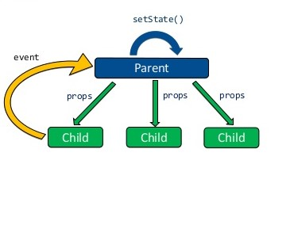
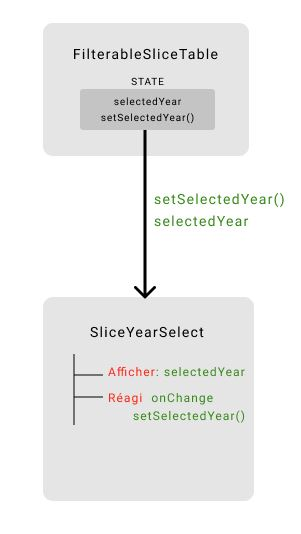

# 5. Formulaires

La gestion des formulaires est gérée de manière assez différente en React qu'avec d'autres frameworks. Il y a moins de "magie" qu'en AngularJS par exemple, ce qui signifie qu'il y a plus de code à écrire ou bien qu'on peut ajouter une librairie pour nous aider à gérer les formulaires.

## 5.1 Gestion des événements

Connaitre le fonctionnement des événements est un prérequis à la gestion des formulaires en React.

La gestion des événements pour les éléments React est très similaire à celle des éléments du DOM. Cf le même exemple en HTML et en React:

```html
<button onclick="hello()">Coucou</button>
```

```jsx
<button onClick={hello}>Coucou</button>
```

Pouvez-vous voir les différences ?

HTML: minuscules et string

React: camelCase et fonction

## 5.2 Gestion des inputs

En HTML, les input utilisateurs maintiennent généralement leur propre état et se mettent à jour par rapport aux saisies de l’utilisateur. En React, l’état modifiable est généralement stocké dans le state des composants.

Exemple en React:

```jsx
function Form() {
  const [name, setName] = useState("");

  const handleChange = (event) => {
    const newValue = event.target.value;
    setName(newValue);
  };

  return <input type="text" value={name} onChange={handleChange} />;
}
```

[JsFiddle](https://jsfiddle.net/thies05/9nkvzase/431/)

L'event ici est un [événement synthétique](https://fr.reactjs.org/docs/events.html), un évènement avec la même interface que l'événement natif, mais compatible avec tous les navigateurs. Il nous sert ici à récupérer la nouvelle valeur du champ à chaque frappe de l'utilisateur.

La gestion des balises [select](https://fr.reactjs.org/docs/forms.html#the-select-tag) et [textarea](https://fr.reactjs.org/docs/forms.html#the-textarea-tag) est très similaire.

On appelle ces composants des composants contrôlés, car la "source unique de vérité" est l'état local React des composants, il n'y a plus d'état gérer par le DOM.

# 6. Faire communiquer des composants

Nous avons appris à créer des composants avec un état interne. Cependant les composants ont besoin d’échanger de l’informations entre eux.
Par exemple, dans le cas de notre projet Bercy, le composant qui permet de sélectionner l’année doit échanger de l’information avec le composant qui permet de lister les tranches d’imposition.
Pour faire communiquer des composants, React propose le pattern de _**"communication unidirectionnel"**_ ou _**"unidirectional data flow"**_ ou _**"One way Data flow"**_

> _La communication unidirectionnelle suggère que les données circulent dans une direction, du parent à l'enfant._



Pour mettre en oeuvre ce pattern, il faudrait passer par ces étapes: la hiérarchisation des composants, le passage des props et la rétropropagation via les callbacks

## 6.1 Hiérarchisation des composants

L’idée est de décomposer l’interface utilisateur en une hiérarchie de composants tout en identifiant les composants père et fils. Dans notre cas nous allons décomposer le composant qui permet d’afficher les tranches d’imposition comme suit :


**:weight_lifting_man: Exercice 6.1 : construire une version statique du composant qui permet d’afficher les tranches**

Vous trouverez ci-dessous l'intégration qui permet de construire le composant d'affichage des tranches

- Créez un fichier **FilterableSliceTable.jsx**
- Créez un composant fonctionnel qui va s'appeller **FilterableSliceTable** (Pensez aux imports necessaires et à l'export du composant)
- Appéllez le composant **FilterableSliceTable** dans le composant **Home**
- En se servant des commentaires laissés dans le code, sortez des composants fonctionnels conformement à la hierachie presentée plus haut (Dans le même fichier)
  > Pour le composant SliceTableRow pensez à passer la bornes inférieures(lowBorn), supérieure(highBorn) et le taux(rate) en Props

```jsx
// FilterableSliceTable
<section className="af-panel">
  <header className="af-panel__header">
    {/* SliceYearSelect */}
    <span className="af-panel__title">Taux d'imposition par année</span>
    <SelectBase
      key="key"
      name="name"
      options={[
        { value: "2019", label: "2019" },
        { value: "2020", label: "2020" },
      ]}
      onChange={() => console.log()}
      value="2020"
    />
  </header>
  <div className="af-panel__content">
    {/* SliceTable */}
    <Table className="af-table">
      {/* SliceTableHeader */}
      <Table.Header>
        <Table.Tr>
          <Table.Th>
            <span className="af-table-th-content">Tranches</span>
          </Table.Th>
          <Table.Th>
            <span className="af-table-th-content">Taux d'imposition</span>
          </Table.Th>
        </Table.Tr>
      </Table.Header>
      <Table.Body>
        {/* SliceTableRow */}
        <Table.Tr>
          <Table.Td>
            <span className="af-table-body-content">jusqu'à 9 964€</span>
          </Table.Td>
          <Table.Td>
            <b>0%</b>
          </Table.Td>
        </Table.Tr>
        {/* SliceTableRow */}
        <Table.Tr>
          <Table.Td>
            <span className="af-table-body-content">de 9964 à 27519</span>
          </Table.Td>
          <Table.Td>
            <b>14%</b>
          </Table.Td>
        </Table.Tr>
      </Table.Body>
    </Table>
  </div>
</section>
```

## 6.2 Flow descendant (props)

Selon le _pattern unidirectionnel_, les composants parents peuvent passer de l'informations à leurs fils. L'idée est que le composant parent crée et passe son état au composant fils via les props.

## 6.3 Flow ascendant (callback)

Nous avons vu comment les composants père peuvent impacter ses fils via les props. Les props étant immutables, le composant père peut passer à ses fils une callback qui permet de mettre à jour ces derniers. Ce qui à pour effet de rétropropagager ces modifications et de déclencher une réactualisation de toute l’arborescence des composants.


**:weight_lifting_man: Exercice 6:**

**_Partie 1: Afficher les tranches d'imposition pour 2020_**

- Déclarez le state qui permet de selectionner l'année et nommé le **selectedYear**
- Votre état doit avoir comme valeur par defaut **"2020"**.
- Afficher les tranches et le taux dans le composant **SliceTableRow** _(Rappel: boucle et gestion des indexes)_
- Vous disposez ci-dessous d'une fonction qui retourne les tranches pour les années 2019 et 2020

> Pour récupèrer les tranches d’une année, vous pouvez utiliser la fonction find donc voici la [doc find](https://developer.mozilla.org/fr/docs/Web/JavaScript/Reference/Objets_globaux/Array/find)

```javascript
const getAllTranches = () => [
  {
    year: "2019",
    tranches: [
      {
        id: 1,
        rate: 0,
        lowBorn: 0,
        highBorn: 10064,
      },
      {
        id: 2,
        rate: 14,
        lowBorn: 10064,
        highBorn: 27794,
      },
      {
        id: 3,
        rate: 30,
        lowBorn: 27794,
        highBorn: 74517,
      },
      {
        id: 4,
        rate: 41,
        lowBorn: 74517,
        highBorn: 157806,
      },
      {
        id: 5,
        rate: 45,
        lowBorn: 157806,
      },
    ],
  },
  {
    year: "2020",
    tranches: [
      {
        id: 1,
        rate: 0,
        lowBorn: 0,
        highBorn: 10064,
      },
      {
        id: 2,
        rate: 11,
        lowBorn: 10064,
        highBorn: 25659,
      },
      {
        id: 3,
        rate: 30,
        lowBorn: 25659,
        highBorn: 73369,
      },
      {
        id: 4,
        rate: 41,
        lowBorn: 73369,
        highBorn: 157806,
      },
      {
        id: 5,
        rate: 45,
        lowBorn: 157806,
      },
    ],
  },
];
```

**_Partie 2: Dynamiser le tableau qui permet d'afficher les tranches d'imposition_**

Le composant père (_FilterableSliceTable_) garde l'état qui contient l'année selectionnée, nous allons dans ce exercice passer cet état au composant **SliceYearSelect** ainsi que sa fonction de mise à jour.

- Ajoutez au composant **SliceYearSelect** les props **selectedYear** et **setSelectedYear** qui correspondent respectivement à l'année selectionnée et de sa fonction de mise à jour
- Interceptez les changements du composant **SelectBase** via l'évènement **onChange** declenché.
  > La fonction **onChange** déclenche un évènement qui contient les propriété suivantes:
  >
  > ```javascript
  > id: "id unique de l'élement du DOM";
  > name: "l'attribut name passé au composant";
  > value: "valeur selectioinnée"; // dans notre cas 2019 ou 2020
  > ```

**:weight_lifting_man: Exercice 7 : Formulaire Bercy**

**_Partie 1: Créer un formulaire permettant de saisir les informations d’un ménage._**

- Créez les composants **TaxComputationForm** _(utiliser l’intégration html ci-dessous)_
- Faites fonctionner les champs de saisie afin de pouvoir saisir des valeurs _Nombre adulte(s)_, _Montant salaire, Nombre enfant(s), Année_. Les valeurs par default seront respectivement **1, 0, 0, 2020**.

```jsx
<form className="af-form tax-form">
  <h1 className="af-title--content">Formulaire</h1>
  <div className="af-form__group">
    <dl>
      <dt>Nombre adulte(s) :</dt>
      <dd>
        <Text
          id="adultnumber"
          name="adultnumber"
          value={adultNumber}
          onChange={(event) => ""}
        />
      </dd>
    </dl>
    <dl>
      <dt>Montant salaire :</dt>
      <dd>
        <Text
          id="salaryamount"
          name="salaryamount"
          value={salaryAmount}
          onChange={(event) => ""}
        />
      </dd>
    </dl>
    <dl>
      <dt>Nombre enfant(s) :</dt>
      <dd>
        <Text
          id="numberofchildren"
          name="numberofchildren"
          value={numberOfChildren}
          onChange={(event) => ""}
        />
      </dd>
    </dl>
    <dl>
      <dt>Année :</dt>
      <dd>
        <SelectBase
          key="key"
          name="year"
          options={[
            { value: "2019", label: "2019" },
            { value: "2020", label: "2020" },
          ]}
          value={year}
          onChange={(event) => ""}
        />
      </dd>
    </dl>
  </div>
  <div className="af-form__group af-form__btn">
    <Button
      classModifier="hasiconLeft"
      id="validation-button"
      onClick={(event) => ""}
    >
      <span className="af-btn__text">Calculer</span>
      <i className="glyphicon glyphicon-stats" />
    </Button>
  </div>
</form>
```

**_Partie 2: Calculer et afficher le résultat des impôts_**

- Créer le composant **TaxResult** _(utiliser l’intégration html ci-dessous)_, le composant prend en props : **taxRate** (Taux d'imposition), **taxAmount** (Montant impôt), **numberOfShares** (Nombre de part) à fin de les afficher.

  > :warning: Attention le composant Restitution ne sait pas afficher des nombres, il ne gère que des chaines de caractère.

- **Appel du composant TaxResult** : Appelez le composant dans la page Home en lui passant les props _(pensez à les déclarer comme des variables d’état avant)_
- **Faire fonctionner le bouton de calcul des impôts**

  - Le code qui permet le calcul des impôts a été fourni ci-dessous.
  - Créez à l’intérieure du dossier **shared** le fichier **taxcomputer.helper.js** et collez-y le code de calcul des impôts fournit ci-dessous.
  - Créez dans le composant **TaxComputationForm** la fonction _(handler)_ **computeTaxeHandler**, cette fonction doit faire appel à la fonction **computeTaxeService** en lui passant les bons paramètres

    > :warning: Attention tous les paramètres sont des entiers, pensez à les convertir.

  - Interceptez le click sur le bouton _"Calculer"_ en interceptant l’évènement **onClick**
  - Mettez à jour le composant **TaxComputationForm** pour lui passer en props les callbacks qui permettent de mettre à jours les résultats du calcul du montant des impôts.
  - Appelez les callbacks dans le handler **computeTaxeHandler** afin de notifier le composant **TaxResult** du résultat du calcul.

  ```jsx
  <>
    <h1 className="af-title--content">Résultat</h1>
    <div className="tax-result">
      <Restitution label="Taux d'imposition" value="taxRate" />
      <Restitution label="Montant impôt" value="taxAmount" />
      <Restitution label="Nombre de part" value="numberOfShares" />
    </div>
  </>
  ```

  ```javascript
  //Code qui permet de calculer les impôts à coller dans taxcomputer.helper.js
  const PLAFOND_DEMI_PART = 1567;

  const toPercent = (n) => Math.trunc(n * 10000) / 100;

  const calculerNbParts = (nbAdults, nbEnfant) => {
    let nbPartEnfants = 0;
    if (nbEnfant === 1) {
      nbPartEnfants = 0.5;
    } else if (nbEnfant > 1) {
      nbPartEnfants = nbEnfant - 1;
    }
    return nbAdults + nbPartEnfants;
  };

  const CreerTanchesParAnnee = () => {
    const tranche2019 = [
      {
        tauxImposition: 0.0,
        limiteInf: 0,
        limiteSup: 10064,
      },
      {
        tauxImposition: 0.14,
        limiteInf: 10064,
        limiteSup: 27794,
      },
      {
        tauxImposition: 0.3,
        limiteInf: 27794,
        limiteSup: 74517,
      },
      {
        tauxImposition: 0.41,
        limiteInf: 74517,
        limiteSup: 157806,
      },
      {
        tauxImposition: 0.45,
        limiteInf: 157806,
      },
    ];
    const tranche2020 = [
      {
        tauxImposition: 0.0,
        limiteInf: 0,
        limiteSup: 10064,
      },
      {
        tauxImposition: 0.11,
        limiteInf: 10064,
        limiteSup: 25659,
      },
      {
        tauxImposition: 0.3,
        limiteInf: 25659,
        limiteSup: 73369,
      },
      {
        tauxImposition: 0.41,
        limiteInf: 73369,
        limiteSup: 157806,
      },
      {
        tauxImposition: 0.45,
        limiteInf: 157806,
      },
    ];

    return {
      [2019]: tranche2019,
      [2020]: tranche2020,
    };
  };

  const getTranchesParAnnee = (annee) => {
    const tranchesParAnnee = CreerTanchesParAnnee();

    return tranchesParAnnee[annee];
  };

  const calculImpotParTranche = (salaireBrut, nbParts, annee) => {
    const salaireImposableParPart = (salaireBrut - salaireBrut * 0.1) / nbParts;
    const tranches = getTranchesParAnnee(annee);
    const impotBrute =
      tranches.reduce((prev, curr) => {
        if (salaireImposableParPart >= curr.limiteSup) {
          // on paye plein impôt par rapport à la tranche
          return prev + (curr.limiteSup - curr.limiteInf) * curr.tauxImposition;
        } else if (salaireImposableParPart >= curr.limiteInf) {
          // on paye un impôt à la marge
          return (
            prev +
            (salaireImposableParPart - curr.limiteInf) * curr.tauxImposition
          );
        } else {
          // On ne paye pas d'impôt pour cette tranche
          return prev;
        }
      }, 0) * nbParts;
    return impotBrute;
  };

  const calculMajorationQuotienFamilial = (nbPart) => 2 * (nbPart - 2);

  /**
   *
   * @param {numer} salaryAmount
   * @param {number} adultNumber
   * @param {number} numberOfChildren
   * @param {number} year
   */
  export const computeTaxeService = (
    salaryAmount,
    adultNumber,
    numberOfChildren,
    year
  ) => {
    const numberOfShares = calculerNbParts(adultNumber, numberOfChildren);
    const calcul1 = calculImpotParTranche(salaryAmount, numberOfShares, year);
    let taxAmount = calcul1;
    if (adultNumber > 1 && numberOfChildren !== 0) {
      const impotAdultes = calculImpotParTranche(salaryAmount, 2, year);
      const calcul2 =
        impotAdultes -
        PLAFOND_DEMI_PART * calculMajorationQuotienFamilial(numberOfShares);
      if (calcul1 < calcul2) {
        taxAmount = calcul2;
      }
    }
    return {
      taxAmount: Math.trunc(taxAmount),
      taxRate: toPercent(taxAmount / salaryAmount),
      numberOfShares,
    };
  };
  ```
